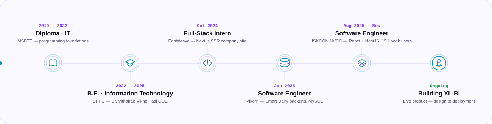
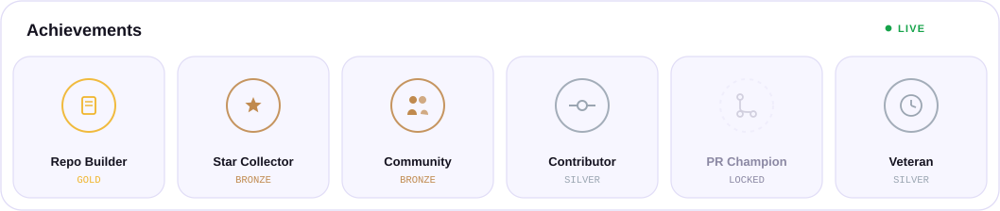
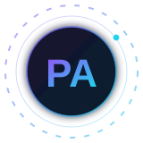

<picture>
  <source media="(prefers-color-scheme: dark)" srcset="assets/banner-dark.svg">
  <source media="(prefers-color-scheme: light)" srcset="assets/banner-light.svg">
  
</picture>

  

 

<picture>
  <source media="(prefers-color-scheme: dark)" srcset="assets/profile-card-dark.svg">
  <source media="(prefers-color-scheme: light)" srcset="assets/profile-card-light.svg">
  
</picture>

 

## About Me

I'm a **Full-Stack Developer at ISKCON NVCC, Pune**, building and maintaining production web applications with **React.js, Node.js, NestJS and TypeScript**. The internal platforms I work on serve around **5,000 users a day and peak at 15,000**, so I care as much about clean schemas, secure APIs and fast queries as I do about a polished, responsive UI. I also bring machine learning into the products I build, and I'm currently growing into **Generative AI** for full-stack apps.

- ⚛️ **Frontend:** React.js, Next.js, Redux, Material UI and Tailwind CSS, with responsive, cross-browser interfaces
- 🧩 **Backend:** RESTful APIs in Node.js, Express, NestJS and Go (Gin), with JWT authentication and role-based access control
- 🗄️ **Databases:** PostgreSQL, MySQL and MongoDB, including schema design, TypeORM and query optimization
- 🤖 **AI / ML:** trained a TensorFlow/Keras model with scikit-learn preprocessing and served it through a Flask API to a React frontend
- 🚀 **Shipping:** I deploy my own products on a VPS with Nginx, SSL/TLS and PM2
- 🤝 **Teamwork:** Agile/Scrum, code review, testing and debugging production issues across every layer
- 📍 **Pune, India:** open to relocate, with a notice period of 30 days or less

Right now I'm building **[XL-BI](https://xl-bi.com)**, a live, revenue-generating product I designed, built and run end to end.

 

## Tech Stack

<picture>
  <source media="(prefers-color-scheme: dark)" srcset="assets/techstack-dark.svg">
  <source media="(prefers-color-scheme: light)" srcset="assets/techstack-light.svg">
  
</picture>

 

## How I Build

<picture>
  <source media="(prefers-color-scheme: dark)" srcset="assets/architecture-dark.svg">
  <source media="(prefers-color-scheme: light)" srcset="assets/architecture-light.svg">
  
</picture>

 

## Featured Projects

<picture>
  <source media="(prefers-color-scheme: dark)" srcset="assets/projects-dark.svg">
  <source media="(prefers-color-scheme: light)" srcset="assets/projects-light.svg">
  
</picture>

<!-- PROJECT-LINKS:START -->

<!-- PROJECT-LINKS:END -->

 

## Career Journey

<picture>
  <source media="(prefers-color-scheme: dark)" srcset="assets/timeline-dark.svg">
  <source media="(prefers-color-scheme: light)" srcset="assets/timeline-light.svg">
  
</picture>

<strong>Experience in detail</strong>

 

**Software Engineer, ISKCON NVCC, Pune** · *Aug 2025 – Present*
- Develop and maintain internal web applications (Course Platform, CDD, DCS) with React.js, Material UI and NestJS, serving about 5,000 users a day and peaking at 15,000.
- Build and document secure REST APIs in NestJS and Node.js with JWT/RBAC authentication and validation layers, and design and optimize PostgreSQL schemas.
- Troubleshoot and debug production issues across the API, service, ORM and database layers.

**Software Engineer, Vikern Smart Invent Software Technology** · *Jan 2025 – Apr 2025*
- Owned backend development of a Smart Dairy Management System (Node.js, Express, MySQL) covering collection tracking, purchase and delivery workflows and financial ledgers.
- Built REST APIs with RBAC and strict data validation, and optimized SQL queries and schemas to speed up daily reporting.

**Analyst Trainee & Full-Stack Developer Intern, EonWeave Solutions** · *Oct 2024 – Mar 2025*
- Built the company website in Next.js with page routing and server-side rendering, improving load performance, SEO and responsiveness.

**Education:** B.E. in Information Technology, Dr. Vithalrao Vikhe Patil College of Engineering (SPPU), 2022–2025 · Diploma in Information Technology, MSBTE, 2019–2022

**Certifications:** MERN Stack Web Development · Full Stack Java Developer · Cloud Fundamentals

 

## GitHub Stats

<table align="center">
<tr>
<td valign="top" width="50%">

<picture>
  <source media="(prefers-color-scheme: dark)" srcset="assets/stats-dark.svg">
  <source media="(prefers-color-scheme: light)" srcset="assets/stats-light.svg">
  
</picture>

</td>
<td valign="top" width="50%">

<picture>
  <source media="(prefers-color-scheme: dark)" srcset="assets/languages-dark.svg">
  <source media="(prefers-color-scheme: light)" srcset="assets/languages-light.svg">
  
</picture>

</td>
</tr>
</table>

<picture>
  <source media="(prefers-color-scheme: dark)" srcset="assets/trophies-dark.svg">
  <source media="(prefers-color-scheme: light)" srcset="assets/trophies-light.svg">
  
</picture>

 

## Currently Exploring

I'm extending my full-stack work into **Generative AI**, adding LLM-powered features such as smart search, document Q&A and assistants to the kinds of web apps I already build.

 

## Contribution Graph

<picture>
  <source media="(prefers-color-scheme: dark)" srcset="https://raw.githubusercontent.com/AtrePramod/atrepramod/output/github-snake-dark.svg">
  <source media="(prefers-color-scheme: light)" srcset="https://raw.githubusercontent.com/AtrePramod/atrepramod/output/github-snake.svg">
  
</picture>

 

<strong>How this profile stays up to date</strong>

 

Every visual on this page is a self-contained animated SVG with no third-party rendering service behind it.

- **`.github/scripts/build_design_assets.py`** draws the banner, profile card, tech stack, architecture, projects and timeline in dark and light versions, embedding the photos from `assets/photo-portrait.jpg` and `assets/photo-avatar.jpg`. Edit the content at the top of the file and run it again to update them.
- **`update-stats.yml`** runs `generate_profile_assets.py` on every push and once a day, pulls real numbers from the GitHub API and redraws the stats, languages and achievements cards.
- **`snake.yml`** turns the contribution calendar into the animated snake every 12 hours and publishes it to the `output` branch.

 

Designed &amp; built by Pramod Atre · Full-Stack Developer · Pune, India

